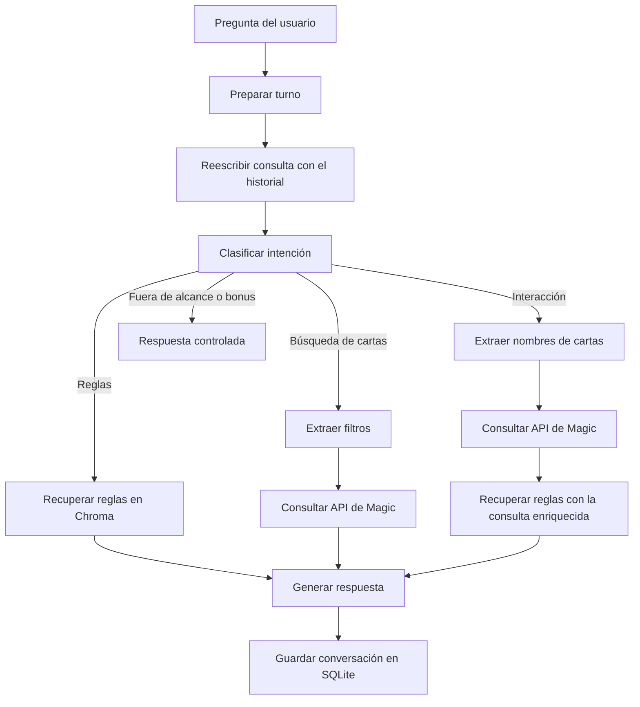

# MTG Agent

Demo conversacional para resolver consultas sobre **Magic: The Gathering** mediante LangChain, LangGraph, Ollama, RAG y la API pública de Magic.

Documentación adicional:

- [Propuesta de evolución a producción](docs/production_solution.md).
- [Revisión y mejora del código proporcionado](code_review.md).

## Capacidades

- Responde preguntas generales sobre las reglas utilizando como referencia las *Magic Comprehensive Rules*.
- Busca cartas a partir de descripciones en lenguaje natural, como color, tipo, subtipo, texto o coste de maná.
- Analiza interacciones entre cartas combinando su texto oficial con las reglas recuperadas del manual.
- Mantiene el contexto entre turnos y convierte las preguntas de seguimiento en consultas independientes.
- Rechaza consultas que no estén relacionadas con Magic.

La creación de cartas personalizadas no forma parte del flujo principal del MVP. Se incluye un prototipo independiente en `nodes/custom_card.py` que demuestra cómo generar una ilustración mediante `x/z-image-turbo`, pero no está conectado al grafo. Estas peticiones se redirigen a la respuesta de fuera de alcance.

## Arquitectura



LangGraph coordina las distintas rutas:

1. `PrepareTurn` limpia el estado temporal del turno y obtiene el último mensaje del usuario.
2. `RewriteQuery` utiliza el historial para resolver referencias a mensajes anteriores, como "esa carta" o "la anterior".
3. `Classifier` selecciona la ruta `rules`, `card_search`, `card_interaction`, `custom_card` u `out_of_scope`.
4. Los nodos de cada ruta consultan Chroma, la API de Magic o ambas fuentes.
5. `GenerateAnswer` redacta una respuesta apoyada exclusivamente en el contexto recuperado.
6. `SqliteSaver` conserva los mensajes de la conversación mediante un `thread_id`.

## Preparación del reglamento

El parser procesa el PDF línea a línea y utiliza el texto, la posición horizontal y el tamaño de fuente para distinguir capítulos, secciones, reglas y subreglas. Se genera un chunk por regla, manteniendo sus subreglas dentro del mismo bloque.

Cada chunk incluye, entre otros campos:

- capítulo y sección;
- número de regla y subreglas;
- página inicial y final;
- texto original y texto preparado para embeddings;
- nombre y hash SHA-256 del documento fuente.

El repositorio incluye los 1164 chunks resultantes en `data/processed/rule_chunks.jsonl`. La base de Chroma no se versiona porque es un artefacto regenerable.

## Requisitos

- Python 3.11.
- Ollama instalado y ejecutándose.
- Acceso desde Ollama al modelo `gemma4:31b-cloud`.
- Conexión a internet para Ollama Cloud, la API de Magic y la primera descarga del modelo de embeddings `BAAI/bge-m3`.

No se necesitan claves ni variables de entorno para ejecutar la demo.

## Instalación

Desde la raíz del repositorio:

```bash
conda create -n mtg-agent python=3.11
conda activate mtg-agent
pip install -r requirements.txt
```

Comprueba que Ollama está disponible y que puedes utilizar el modelo configurado:

```bash
ollama run gemma4:31b-cloud
```

## Construcción del índice

El JSONL procesado ya está incluido. Si se quiere regenerar desde el PDF:

```bash
PYTHONPATH="$PWD/src" python -m mtg_agent.pdf_parser
```

Para generar los embeddings y crear la colección persistente de Chroma:

```bash
PYTHONPATH="$PWD/src" python -m mtg_agent.index_chroma
```

Este paso debe ejecutarse al menos una vez después de clonar el repositorio.

## Ejecución

```bash
PYTHONPATH="$PWD/src" python -m mtg_agent.main
```

La aplicación genera un identificador de conversación y mantiene el mismo hilo hasta que se escribe `salir`, `exit` o `quit`.

Ejemplos de consultas:

```text
¿Qué fases hay en un turno?
Busco una carta blanca, guerrero y de coste inferior a dos de maná.
¿Qué ocurre si Battlefield Raptor hace daño de dañar primero y lo cambio por Ninja of the Deep Hours?
```

## Pruebas

Desde la raíz del repositorio:

```bash
PYTHONPATH="$PWD/src" python -m pytest -q
```

La suite comprueba las partes deterministas principales del MVP: los chunks del reglamento, la preparación de cada turno, la construcción de consultas a la API de Magic y el enriquecimiento de las preguntas sobre interacciones. Las llamadas a Ollama y a la API externa no se ejecutan durante los tests.

## Estructura del proyecto

```text
.
├── data/
│   ├── raw/                  # Reglamento original
│   ├── processed/            # Chunks en JSONL
│   ├── chroma/               # Índice local, no versionado
│   └── checkpoints/          # Memoria SQLite, no versionada
├── src/mtg_agent/
│   ├── nodes/                # Nodos del flujo y prototipo custom_card.py
│   ├── core.py               # Carga del modelo y Chroma
│   ├── graph.py              # Estado, rutas y grafo
│   ├── index_chroma.py       # Indexación vectorial
│   ├── main.py               # Interfaz de terminal
│   └── pdf_parser.py         # Parseo y chunking del PDF
├── tests/                         # Tests deterministas del MVP
└── requirements.txt
```

## Decisiones del MVP

- Se crea un chunk por regla completa para preservar juntas sus subreglas y su contexto normativo.
- Los embeddings se generan localmente con `BAAI/bge-m3` y se normalizan para usar similitud del coseno.
- La búsqueda de cartas se divide entre extracción de filtros mediante LLM y una llamada determinista a la API.
- Las interacciones enriquecen la consulta RAG con el texto de las cartas antes de recuperar reglas.
- El historial se guarda en SQLite, aunque cada ejecución de terminal comienza una conversación nueva.
- La interfaz es deliberadamente una CLI; una interfaz web queda fuera del alcance del MVP.

## Limitaciones y trabajo futuro

- El prototipo de generación de ilustraciones para cartas personalizadas no está conectado al grafo ni forma parte de la ejecución del MVP.
- Los tests automatizados cubren las funciones deterministas principales, pero no evalúan las respuestas generadas por el modelo ni realizan pruebas end-to-end.
- No hay reintentos, caché ni tratamiento específico de indisponibilidad para Ollama Cloud o la API de Magic.
- Las respuestas dependen de que el modelo cloud devuelva el JSON solicitado por los nodos de extracción y clasificación.
- La búsqueda puede devolver distintas ediciones de una misma carta; el MVP limita la respuesta, pero no elimina duplicados.
- No se normalizan nombres localizados de cartas al nombre inglés utilizado por la API.
- La CLI no permite recuperar una conversación anterior indicando su `thread_id`.

La evolución a producción debería incorporar una API de servicio, una interfaz para agentes del call center, gestión de sesiones e identidad, observabilidad de trazas y costes, evaluación automática del RAG, métricas de calidad, reintentos, caché, límites de uso, despliegue reproducible y monitorización de dependencias externas.

## Fuentes

- *Magic: The Gathering Comprehensive Rules*, versión incluida en `data/raw/`.
- [Magic: The Gathering API](https://docs.magicthegathering.io/).
