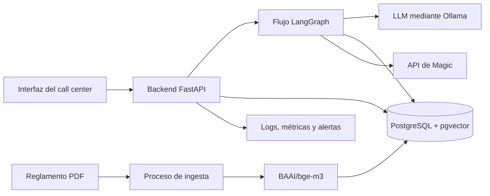

# Propuesta de evolución a producción

## 1. Objetivo y alcance

El MVP demuestra que es posible combinar el reglamento de Magic, la API de cartas y un modelo de lenguaje dentro de un flujo conversacional. Para utilizarlo en un call center harían falta, además, una interfaz accesible, almacenamiento compartido, control de acceso, monitorización y un proceso seguro de despliegue.

Esta propuesta plantea una primera versión productiva sencilla para un call center pequeño o medio. No se propone una arquitectura de microservicios ni Kubernetes porque no conocemos todavía un volumen que justifique esa complejidad.

Antes de desarrollarla habría que confirmar con el cliente:

- número de agentes y consultas simultáneas;
- tiempo de respuesta y disponibilidad esperados;
- idiomas que debe soportar;
- datos personales que pueden aparecer en las conversaciones;
- tiempo durante el que se debe conservar el historial;
- integración necesaria con las herramientas actuales del call center;
- presupuesto y restricciones sobre el uso de modelos cloud.

## 2. Arquitectura propuesta

La solución comenzaría como una aplicación modular desplegada en contenedores. El backend contendría el grafo y sus nodos, pero el código seguiría separado por responsabilidades. Esto permite mantener una operación sencilla y dividir servicios más adelante solo si el uso real lo requiere.

### Componentes principales

| Componente | Responsabilidad |
|---|---|
| Interfaz web | Permitir al agente escribir preguntas, consultar el historial y ver las referencias utilizadas. |
| Backend FastAPI | Autenticar al usuario, validar la petición, ejecutar el grafo y devolver la respuesta. |
| LangGraph | Controlar la clasificación y las rutas de reglas, búsqueda e interacción entre cartas. |
| PostgreSQL | Guardar usuarios, sesiones, mensajes, feedback y datos de auditoría. |
| pgvector | Almacenar y consultar los embeddings del reglamento dentro de PostgreSQL. |
| Ollama | Dar acceso al modelo utilizado por los nodos de lenguaje. |
| API de Magic | Obtener el texto y las características actualizadas de las cartas. |
| Proceso de ingesta | Procesar una nueva versión del reglamento y actualizar el índice vectorial. |

En el MVP se utiliza Chroma porque permite construir una demo local con facilidad. Para esta propuesta se utilizaría PostgreSQL con pgvector para concentrar los datos de negocio y los vectores en un almacenamiento compartido, con copias de seguridad y acceso desde varias instancias. Antes de migrar se mediría que su rendimiento sea suficiente para el volumen del cliente.

## 3. Flujo conversacional

El diseño continuaría siendo un grafo controlado. No se daría libertad completa a un agente para decidir y ejecutar llamadas sin límite.

1. El backend recibe la pregunta y el identificador de conversación.
2. Se recuperan los mensajes necesarios de esa conversación.
3. `RewriteQuery` convierte la última pregunta en una consulta independiente.
4. `Classifier` decide qué ruta debe seguir.
5. Los nodos deterministas consultan la base vectorial o la API de Magic.
6. El nodo de respuesta utiliza únicamente el contexto obtenido.
7. Se guardan la respuesta, las fuentes y la información básica de la ejecución.

El LLM se utiliza donde aporta comprensión del lenguaje: reescritura, clasificación, extracción y redacción. Las consultas externas se mantienen en funciones deterministas para limitar su comportamiento y facilitar los tests.

Si no se recupera información suficiente o una dependencia no está disponible, el sistema debe reconocerlo. En un call center, el agente humano puede continuar la atención en lugar de recibir una respuesta inventada.

## 4. Ingesta y actualización del reglamento

Las reglas cambian con menos frecuencia que las consultas, por lo que no es necesario construir inicialmente un sistema de ingesta continuo. Se podría ejecutar un trabajo controlado cuando se publique una nueva versión:

1. Guardar el PDF original y calcular su hash.
2. Comprobar que esa versión no se haya procesado anteriormente.
3. Ejecutar el parser y sus validaciones.
4. Generar los embeddings.
5. Guardarlos como una nueva versión del índice.
6. Ejecutar un conjunto de preguntas de prueba.
7. Activar la nueva versión si supera las comprobaciones.

No se eliminaría inmediatamente la versión anterior. Mantenerla durante un tiempo permitiría volver atrás si se detecta un error.

Junto a cada chunk se guardarían los metadatos que ya existen en el MVP: versión del parser, hash, documento, páginas, capítulo, sección y número de regla. Esto hace posible explicar de dónde procede la respuesta.

## 5. Integración con la API de Magic

Las llamadas a la API tendrían un timeout y un número pequeño de reintentos para errores temporales. No se reintentarían indefinidamente. Si la API sigue sin responder, el sistema informaría de que no puede verificar en ese momento los datos de las cartas.

Antes del despliegue también habría que resolver dos limitaciones del MVP:

- normalizar los nombres localizados, por ejemplo entre español e inglés;
- eliminar o agrupar las distintas ediciones de una misma carta cuando no sean relevantes.

Se podría añadir una caché para las consultas frecuentes, pero solo después de medir el uso real. La caché tendría una caducidad para no conservar datos desactualizados.

## 6. Memoria y sesiones

SQLite es suficiente para una demo ejecutada por una sola persona. En producción, los mensajes y el estado se guardarían en PostgreSQL para que distintas instancias del backend puedan acceder a la misma conversación.

Cada petición incluiría un identificador de usuario y un `thread_id`. El backend comprobaría que ese usuario tiene permiso para acceder al hilo solicitado, evitando mezclar conversaciones.

No se enviaría siempre todo el historial al modelo. Para conversaciones largas se utilizarían los últimos mensajes y, si fuera necesario, un resumen del contexto anterior. La política de conservación y borrado se acordaría con el cliente.

## 7. Seguridad

La primera versión productiva debería incluir:

- autenticación de los empleados, preferiblemente integrada con el sistema de identidad del cliente;
- comprobación de permisos sobre cada conversación;
- HTTPS para todas las comunicaciones;
- secretos fuera del repositorio y gestionados por la plataforma de despliegue;
- límites de tamaño y frecuencia para las peticiones;
- dependencias y dominios externos permitidos de forma explícita;
- registro de accesos y cambios relevantes;
- una política para no enviar datos personales innecesarios al proveedor del modelo.

### Privacidad y elección del modelo

Las preguntas sobre Magic no necesitan normalmente datos personales. Aun así, en un call center un usuario podría incluir nombres, teléfonos, correos u otra información sensible. La primera medida sería minimizar los datos: no recogerlos ni enviarlos al modelo cuando no sean necesarios para resolver la consulta.

La forma de tratar estos datos dependería de las políticas y requisitos regulatorios del cliente. Se podrían valorar tres alternativas:

1. **Modelo cloud con condiciones adecuadas:** comprobar con el proveedor la retención, la región de procesamiento, el uso de los datos para entrenamiento y las medidas de seguridad ofrecidas.
2. **Anonimización local antes de utilizar el cloud:** un componente local detectaría datos sensibles y los sustituiría por referencias como `[PERSONA_1]` o `[TELEFONO_1]`. La correspondencia original se conservaría, si fuera imprescindible, dentro de la infraestructura del cliente.
3. **Modelo completamente local:** para datos especialmente sensibles o cuando el cliente no permita enviarlos a servicios externos, tanto el procesamiento como la generación se ejecutarían en su propia infraestructura.

La detección de datos sensibles podría combinar reglas deterministas con un modelo local ligero. Por ejemplo, una expresión regular puede identificar correos o teléfonos, mientras que el modelo podría ayudar a reconocer nombres o información menos estructurada.

La decisión final se tomaría junto con los responsables de seguridad y privacidad del cliente, después de identificar qué datos se procesan realmente. No se añadiría una infraestructura local costosa si las conversaciones no contienen información sensible o si una alternativa cloud cumple los requisitos acordados.

Los documentos recuperados y las respuestas de herramientas se tratarían como datos, no como nuevas instrucciones para el sistema. Esta separación ayuda a reducir el riesgo de prompt injection.

## 8. Observabilidad y monitorización

Cada consulta tendría un identificador de traza compartido por todos los nodos. Los logs serían estructurados y no incluirían el texto completo de la conversación salvo que el cliente lo autorice.

Como mínimo se controlarían:

- número de consultas y errores;
- latencia total y por nodo;
- fallos y tiempos de espera de Ollama y de la API de Magic;
- intención seleccionada;
- respuestas sin contexto suficiente;
- reglas y cartas utilizadas como referencia;
- consumo del modelo, cuando el proveedor facilite ese dato;
- valoración positiva o negativa del agente del call center.

Las alertas iniciales se limitarían a problemas sobre los que se pueda actuar, como un aumento de errores, una dependencia externa que no responde o un tiempo de respuesta anormalmente alto.

Para implementar esta monitorización se podrían utilizar logs centralizados, un servicio de registro de errores y paneles con las métricas principales. La herramienta concreta dependería de la plataforma que ya utilizase el cliente.

## 9. Evaluación y tests

Se crearía un conjunto pequeño y revisado de preguntas de referencia con ejemplos de:

- reglas básicas;
- búsquedas con diferentes filtros;
- interacciones entre cartas;
- preguntas de seguimiento;
- preguntas fuera de alcance;
- preguntas sin información suficiente.

Los tests unitarios comprobarían el parser, la validación de filtros, la preparación del turno y las rutas del grafo. Los tests de integración comprobarían la recuperación vectorial y simularían las respuestas de la API de Magic. Un grupo más pequeño de pruebas end-to-end utilizaría el modelo real.

Antes de cambiar el modelo, los prompts o el reglamento, se ejecutaría el conjunto de evaluación. Se revisarían especialmente:

- precisión del clasificador;
- presencia de la regla esperada entre los primeros resultados;
- fidelidad de la respuesta a las fuentes;
- porcentaje de respuestas que reconocen correctamente la falta de contexto;
- latencia y errores.

La valoración de los agentes del call center permitiría incorporar casos reales al conjunto de pruebas, después de revisar y anonimizar los datos.

Como apoyo, también se podría utilizar un enfoque de *LLM as a judge*: un segundo modelo evaluaría las respuestas según criterios definidos, como claridad, relación con las fuentes recuperadas y ausencia de información inventada. Estas valoraciones no se utilizarían como única medida de calidad, ya que también pueden ser variables o contener sesgos. Antes de utilizarlas de forma automática, se compararían con un conjunto pequeño de respuestas revisadas por personas.

## 10. Despliegue, escalabilidad y fallos

El backend se empaquetaría con Docker. Un pipeline sencillo de integración continua ejecutaría los tests, construiría la imagen y la desplegaría primero en un entorno de staging. Tras una prueba de humo se promovería la misma imagen a producción.

Se conservaría la imagen anterior para poder revertir un despliegue. Las migraciones de base de datos también necesitarían una estrategia de vuelta atrás o compatibilidad con ambas versiones durante el cambio.

La aplicación comenzaría con una o pocas instancias. Si las métricas muestran que no son suficientes, el backend podría replicarse porque las conversaciones y los vectores estarían en PostgreSQL. No se introduciría un orquestador más complejo hasta que el volumen lo justificase.

Para los fallos externos se aplicarían timeouts, reintentos limitados y respuestas controladas. El objetivo no sería ocultar todos los errores, sino evitar bloqueos y permitir que el operador humano continúe atendiendo al cliente.

## 11. Creación de cartas custom

La creación de cartas es un bonus y quedaría fuera de la primera versión productiva. Como evolución se podría dividir en cuatro pasos:

1. Generar una definición estructurada de la carta.
2. Validar sus campos y la sintaxis de sus habilidades.
3. Generar o seleccionar una ilustración.
4. Renderizar el resultado mediante una plantilla.

Antes de ofrecerlo a usuarios habría que revisar moderación, propiedad intelectual y uso de personajes protegidos. El resultado debería requerir confirmación humana.

## 12. Diferencias respecto al MVP

| MVP actual | Primera versión productiva |
|---|---|
| Interfaz de terminal | Interfaz web integrada con el call center |
| Un proceso local | Backend en contenedor con una o pocas instancias |
| Chroma local | PostgreSQL compartido con pgvector |
| SQLite para memoria | PostgreSQL para sesiones y mensajes |
| Conversación nueva al arrancar | Recuperación de conversaciones autorizadas |
| Sin autenticación | Identidad y permisos del cliente |
| Tests deterministas básicos | Tests unitarios, de integración y evaluación de regresión |
| Salida por terminal | Logs, métricas, alertas y feedback |
| Errores propagados | Timeouts, reintentos limitados y respuesta controlada |
| Despliegue manual | Docker, staging, pipeline y rollback |

## 13. Implantación por fases

Para reducir el riesgo, el trabajo se podría dividir en:

1. **Validación:** confirmar requisitos con el cliente y crear el conjunto inicial de evaluación.
2. **Servicio interno:** exponer el grafo mediante FastAPI, añadir PostgreSQL, autenticación y una interfaz sencilla.
3. **Piloto:** permitir el acceso a un grupo reducido de agentes, recoger feedback y medir errores y latencia.
4. **Despliegue general:** corregir los problemas del piloto, definir alertas y ampliar el acceso.
5. **Mejoras posteriores:** traducciones, caché, nuevas fuentes y, si aporta valor, creación de cartas custom.

Este enfoque permite comprobar primero que la herramienta ayuda realmente a los agentes antes de aumentar la complejidad de la arquitectura.
